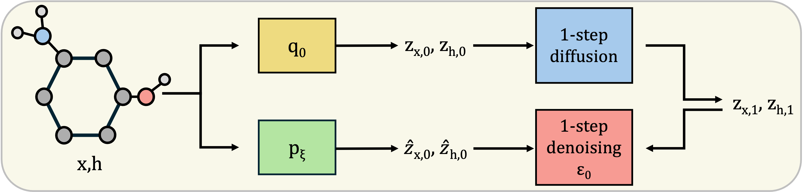

# Markov Chain Monte Carlo for Unconditional Molecule Generation

<!-- [](https://github.com/MinkaiXu/GeoLDM/blob/main/LICENSE)
[](https://arxiv.org/abs/2305.01140) -->

<!-- [[Code](https://github.com/MinkaiXu/GeoLDM)] -->



This work aims to leverage MCMC to sample novel, drug-like ligands based on molecules in the QM9 dataset. We train a graph-based molecular diffusion model, GeoLDM, and implement a sampling technique known as continuous walk-jump sampling (cWJS) which has previously proven effective for unconditional ligand generation on other molecular representations. Applying this variant of sampling allows us to streamline the training procedure of GeoLDM by reducing the number of diffusion steps and simplifying the noise schedule. By training and sampling based on QM9, we can compare the ligands generated by our graph-based cWJS method to both a graph-based dif-
fusion method, GeoLDM, and a voxel-based cWJS method, VoxMol.

## Environment

Install the required packages from `requirements.txt`. A simplified version of the requirements can be found [here](https://github.com/ehoogeboom/e3_diffusion_for_molecules/blob/main/requirements.txt).

## Evaluate the Models

### Original GeoLDM Model + Varying Noise Schedules

To analyze the sample quality of molecules trained with the original GeoLDM model trained with a polynomial, uniform or constant schedules. Set ```model_path``` to the model trained with the corresponding noise schedule:

```python eval_analyze.py --model_path shell_scripts/outputs/$exp_name --n_samples 1000```

To visualize some molecules:

```python eval_sample.py --model_path shell_scripts/outputs/$exp_name --n_samples 1000```

### One-step Diffusion Model + cWJS

To analyze the sample quality of molecules generated using cWJS on a model trained with our one-step diffusion model using a constant schedule. Set ```model_path``` to the one-step diffusion model trained:

```python eval_analyze_voxmol.py --model_path shell_scripts/outputs/$exp_name --n_samples 1000```

To visualize some molecules:

```python eval_sample_voxmol.py --model_path shell_scripts/outputs/$exp_name --n_samples 1000```

### Original GeoLDM Model + Varying Noise Schedules + cWJS

To analyze the sample quality of molecules generated using cWJS on models trained with the original GeoLDM model trained with a polynomial, uniform or constant schedules. Set ```model_path``` to the path of the model trained:

```python eval_analyze_voxmol.py --model_path shell_scripts/outputs/$exp_name --n_samples 1000```

To visualize some molecules:

```python eval_sample_voxmol.py --model_path shell_scripts/outputs/$exp_name --n_samples 1000```

## Acknowledgements

This repo is built upon the previous work [GeoLDM](https://github.com/MinkaiXu/GeoLDM) and [EDM](https://github.com/ehoogeboom/e3_diffusion_for_molecules). Thanks to the authors for their great work!
